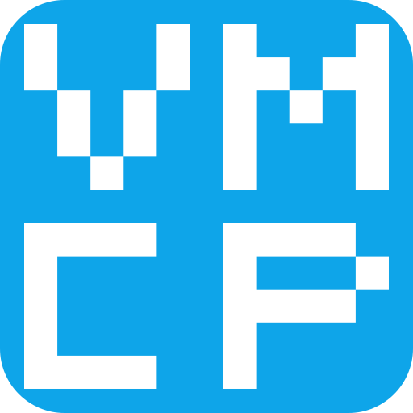

<p align="center">
  
  <h1 align="center">VibeMCP</h1>
  <p align="center">
    <strong>Token-Optimized Unified MCP Server for Gmail & Microsoft 365</strong>
  </p>
  <p align="center">
    <a href="https://www.npmjs.com/package/@vibetensor/vibemcp"></a>
    <a href="https://polyformproject.org/licenses/noncommercial/1.0.0/"></a>
    <a href="https://nodejs.org"></a>
    <a href="https://modelcontextprotocol.io"></a>
    <a href="https://www.typescriptlang.org"></a>
  </p>
  <p align="center">
    One server. Two ecosystems. Half the tokens.
  </p>
  <p align="center">
    <a href="https://vibemcp.vibetensor.com">Documentation</a> · <a href="https://vibemcp.vibetensor.com/guide/getting-started">Getting Started</a> · <a href="https://vibemcp.vibetensor.com/reference/tools">Tools Reference</a>
  </p>
</p>

---

## The Problem

Most email and calendar MCP servers return verbose JSON that wastes tokens:

```json
[
  {"id": "abc123", "subject": "Meeting Tomorrow", "from": "john@example.com", "date": "2025-12-18", "snippet": "Let's meet at 3pm..."},
  {"id": "def456", "subject": "Q4 Report", "from": "jane@example.com", "date": "2025-12-17", "snippet": "Please review the..."}
]
```

**~85 tokens** for 2 messages. Repeated keys (`"id"`, `"subject"`, `"from"`, `"date"`) eat tokens on every row.

## The Solution

VibeMCP uses [TOON (Token-Oriented Object Notation)](https://github.com/toon-format/toon), an open format that declares the schema once, then streams data as tab-delimited rows:

```
messages[2]{id,subject,from,date,snippet}
abc123	Meeting Tomorrow	john@example.com	2025-12-18	Let's meet at 3pm...
def456	Q4 Report	jane@example.com	2025-12-17	Please review the...
```

**~38 tokens** for the same data. No repeated keys, no brackets, no quotes.

Every tool supports both `toon` and `json` output via the `format` parameter.

---

## Benchmarks

Measured on live Gmail and Outlook accounts, February 2026:

| Dataset                      |   TOON |   JSON | Savings |
|:-----------------------------|-------:|-------:|:-------:|
| Gmail - 10 messages          |    591 |    961 | **38%** |
| Outlook - 10 messages        |    872 |  1,480 | **41%** |
| Google Calendar - 11 events  |    441 |  1,462 | **70%** |
| **Combined**                 | **1,904** | **3,903** | **51%** |

Calendar events show 70% savings because the raw Google Calendar API response has deeply nested objects (`start.dateTime`, `attendees[].email`, `organizer.email`) that VibeMCP's service layer flattens to primitive values before TOON encoding.

<details>
<summary><strong>Cost impact at Claude Opus pricing ($15/M input tokens)</strong></summary>

| Usage          | Annual Token Savings | Annual Cost Savings |
|:---------------|---------------------:|:-------------------:|
| 10 calls/day   |          7.3M tokens |          **$109**   |
| 50 calls/day   |         36.5M tokens |          **$547**   |
| 200 calls/day  |          146M tokens |        **$2,190**   |

</details>

---

## Quick Start

### 1. Add to your MCP client

**Claude Code** (`~/.claude.json`):

```json
{
  "mcpServers": {
    "vibemcp": {
      "type": "stdio",
      "command": "npx",
      "args": ["-y", "@vibetensor/vibemcp"]
    }
  }
}
```

### 2. Configure credentials

Pass credentials via your MCP client's `env` block:

```json
{
  "mcpServers": {
    "vibemcp": {
      "type": "stdio",
      "command": "npx",
      "args": ["-y", "@vibetensor/vibemcp"],
      "env": {
        "GOOGLE_CLIENT_ID": "your-google-client-id",
        "GOOGLE_CLIENT_SECRET": "your-google-client-secret",
        "MICROSOFT_CLIENT_ID": "your-azure-client-id",
        "MICROSOFT_TENANT_ID": "common"
      }
    }
  }
}
```

Or create a `.env` file in your working directory or `~/.vibemcp/.env`.

See the [Configuration Guide](https://vibemcp.vibetensor.com/reference/configuration) for Google Cloud and Azure setup.

### 3. Authenticate

Through your AI assistant:

```
> Add my Google account     → opens browser for OAuth
> Add my Microsoft account  → prints device code for microsoft.com/devicelogin
```

Or via CLI:

```bash
npx @vibetensor/vibemcp auth google your@gmail.com
npx @vibetensor/vibemcp auth microsoft your@outlook.com
```

### 4. Use

```
> Show my latest emails
```

```
messages[10]{id,subject,from,date,snippet}
19485abc  Team standup notes  alice@company.com  2026-02-16  Here are the notes...
28ef9d01  Invoice #4521       billing@vendor.com 2026-02-15  Your invoice for...
```

Every tool supports `format: "json"` for standard JSON output.

---

## Tools

**51 tools** across 7 modules:

### Account Management (7)

| Tool                       | Description                                      |
|:---------------------------|:-------------------------------------------------|
| `list_accounts`            | List all connected accounts with auth status     |
| `add_google_account`       | Start Google OAuth flow (browser-based)          |
| `complete_google_auth`     | Complete Google authentication                   |
| `add_microsoft_account`    | Start Microsoft Device Code flow                 |
| `complete_microsoft_auth`  | Complete Microsoft authentication                |
| `remove_account`           | Remove a connected account                       |
| `accounts_status`          | Check auth status and server configuration       |

### Gmail (16)

| Tool                       | Description                                             |
|:---------------------------|:--------------------------------------------------------|
| `gmail_list_messages`      | List/search messages with Gmail search operators        |
| `gmail_get_message`        | Get full message content with body and attachments      |
| `gmail_send_message`       | Send email with RFC 2822 compliance                     |
| `gmail_reply_to_message`   | Reply with proper threading (In-Reply-To / References)  |
| `gmail_create_draft`       | Create a draft email                                    |
| `gmail_list_labels`        | List all Gmail labels                                   |
| `gmail_list_threads`       | List email threads                                      |
| `gmail_get_thread`         | Get full thread with all messages                       |
| `gmail_create_label`       | Create a new Gmail label                                |
| `gmail_update_label`       | Update label name or visibility settings                |
| `gmail_delete_label`       | Delete a user-created label                             |
| `gmail_modify_labels`      | Add or remove labels from specific messages             |
| `gmail_download_attachment`| Download an attachment with metadata                    |
| `gmail_batch_modify`       | Batch archive, read, unread, trash, or untrash messages |
| `gmail_get_vacation`       | Get current out-of-office auto-reply settings           |
| `gmail_set_vacation`       | Enable or disable out-of-office with date range         |

### Outlook (16)

| Tool                       | Description                                      |
|:---------------------------|:-------------------------------------------------|
| `outlook_list_messages`    | List messages with folder filtering              |
| `outlook_get_message`      | Get full message content                         |
| `outlook_send_message`     | Send email via Microsoft Graph                   |
| `outlook_reply_to_message` | Reply to a message                               |
| `outlook_forward_message`  | Forward a message                                |
| `outlook_list_folders`     | List mail folders                                |
| `outlook_move_message`     | Move message between folders                     |
| `outlook_search`           | Search messages via Microsoft Graph              |
| `outlook_list_categories`  | List available Outlook categories                |
| `outlook_set_categories`   | Set categories on a message                      |
| `outlook_set_flag`         | Set follow-up flag on a message                  |
| `outlook_batch_update`     | Batch mark read/unread, archive, or move messages|
| `outlook_download_attachment`| Download an attachment by ID                    |
| `outlook_list_attachments` | List attachments on a message                    |
| `outlook_get_auto_reply`   | Get current auto-reply (OOO) settings            |
| `outlook_set_auto_reply`   | Configure auto-reply with schedule               |

### Calendar (6)

| Tool                       | Description                                         |
|:---------------------------|:----------------------------------------------------|
| `calendar_list_calendars`  | List calendars (Google or Outlook, auto-detected)   |
| `calendar_list_events`     | List events in a time range                         |
| `calendar_create_event`    | Create event with optional recurrence (RRULE)       |
| `calendar_update_event`    | Update an event (Google and Microsoft)              |
| `calendar_delete_event`    | Delete an event                                     |
| `calendar_free_busy`       | Check free/busy availability for calendars          |

### Contacts (3)

| Tool                       | Description                                          |
|:---------------------------|:-----------------------------------------------------|
| `contact_search`           | Search contacts by name or email                     |
| `resolve_contacts`         | Resolve email addresses to display names             |
| `contact_list`             | List contacts from a Google or Microsoft account     |

### Unified / Cross-Account (3)

| Tool                       | Description                                          |
|:---------------------------|:-----------------------------------------------------|
| `unified_search`           | Search across all email accounts simultaneously      |
| `unified_inbox`            | Aggregated unread messages from all accounts         |
| `unified_calendar`         | Merged calendar view across all providers            |

---

## Comparison with Other MCP Servers

| Feature                    | VibeMCP    | gmail-mcp  | ms-365-mcp-server | google_workspace_mcp |
|:---------------------------|:----------:|:----------:|:------------------:|:--------------------:|
| Gmail                      | 16 tools   | 60+ tools  | -                  | 80+ tools            |
| Outlook Mail               | 16 tools   | -          | 90+ tools          | -                    |
| Google Calendar             | 6 tools    | -          | -                  | included             |
| Outlook Calendar            | 6 tools    | -          | included           | -                    |
| Contacts                   | 3 tools    | -          | -                  | included             |
| **Unified (both providers)** | **Yes**  | No         | No                 | No                   |
| **TOON output**            | **Yes**    | No         | No                 | No                   |
| **Multi-account**          | **Native** | No         | No                 | Manual               |
| **Cross-account search**   | **Yes**    | No         | No                 | No                   |
| Token optimization         | **51% avg**| None       | None               | None                 |

Existing TOON MCP servers (like `toon-mcp`) are generic JSON-to-TOON converters. VibeMCP encodes at the source level, selecting optimal fields per data type.

---

## TOON Format

TOON (Token-Oriented Object Notation) encodes structured data as a header + tab-delimited rows:

```
typeName[count]{field1,field2,field3}
value1a	value1b	value1c
value2a	value2b	value2c
```

- **Header** `typeName[count]{fields}` declares the schema once
- **Rows** are tab-separated values, one per line, no repeated keys

For single objects, TOON uses key-value format:

```
message:
  id: msg001
  subject: Meeting Tomorrow
  from: john@example.com
```

**Why TOON beats JSON for LLMs:**

1. **No repeated keys** - JSON repeats `"subject"`, `"from"`, `"date"` for every item. TOON declares fields once in the header.
2. **No syntax noise** - No `{`, `}`, `[`, `]`, `"`, `,` characters consuming tokens.
3. **Self-describing schema** - The `[count]{fields}` header tells the LLM what to expect, improving parsing accuracy.
4. **JSON fallback** - Every tool accepts `format: "json"` for debugging or downstream processing.

See **[TOON.md](TOON.md)** for detailed documentation on nested object handling, schema evolution, and MCP client compatibility.

---

## Architecture

```
src/
  index.ts                # MCP server entry point (StdioServerTransport)
  cli.ts                  # CLI for auth management
  config.ts               # Environment, account registry, scopes
  auth/
    google.ts             # Google OAuth2 with local callback server (port 4100)
    microsoft.ts          # Microsoft MSAL Device Code Flow
    store.ts              # Token file I/O helpers
  services/
    gmail.ts              # Gmail API service (googleapis)
    ms-mail.ts            # Microsoft Graph Mail (native fetch)
    google-calendar.ts    # Google Calendar API service
    ms-calendar.ts        # Microsoft Graph Calendar (native fetch)
    google-contacts.ts    # Google People API for contact resolution
    ms-contacts.ts        # Microsoft Graph People/Contacts
    cache.ts              # Service instance cache (10-min TTL)
  tools/
    admin.ts              # Account management tools (7)
    gmail.ts              # Gmail tool handlers (16)
    outlook.ts            # Outlook tool handlers (16)
    calendar.ts           # Unified calendar tools (6)
    contacts.ts           # Contact search and resolution (3)
    unified.ts            # Cross-account aggregation (3)
  toon/
    encoder.ts            # TOON serialization (encodeToon, formatOutput)
    types.ts              # ToonOptions interface
  utils/
    logger.ts             # stderr-safe logging (protects JSON-RPC stdout)
    errors.ts             # Error categories and formatting
```

**Key design decisions:**

- **`~/.vibemcp/` config directory** - Tokens, accounts, and MSAL cache stored in a persistent user directory (`~/.vibemcp/`), not relative to the package install location. Overridable via `VIBEMCP_CONFIG_DIR` env var.
- **Default = MCP server** - Running `vibemcp` (or `npx @vibetensor/vibemcp`) with no arguments starts the MCP stdio server. CLI subcommands (`auth`, `accounts`) handle setup.
- **stderr-safe logging** - `console.log` redirected to `console.error` at import time, keeping stdout clean for MCP JSON-RPC
- **Static factory pattern** - Services use `ServiceClass.create(email)` because auth initialization is async
- **Provider auto-detection** - Calendar tools check the account registry to route to the correct service
- **Service cache (10-min TTL)** - Authenticated instances are cached to avoid repeated token acquisition

---

## Auth Setup

<details>
<summary><strong>Google OAuth Setup</strong></summary>

1. Go to [Google Cloud Console](https://console.cloud.google.com/apis/credentials)
2. Create a new OAuth 2.0 Client ID (Desktop Application)
3. Add `http://localhost:4100/code` as an authorized redirect URI
4. Enable the Gmail API and Google Calendar API
5. Copy the Client ID and Client Secret to your `.env`

**Scopes requested:**
- `openid` + `userinfo.email` (identity)
- `https://mail.google.com/` (full Gmail access)
- `https://www.googleapis.com/auth/calendar` (Calendar read/write)

</details>

<details>
<summary><strong>Microsoft Auth Setup</strong></summary>

1. Go to [Azure Portal > App Registrations](https://portal.azure.com/#blade/Microsoft_AAD_RegisteredApps/ApplicationsListBlade)
2. Register a new application (any name)
3. Set "Supported account types" to "Personal Microsoft accounts only" or "All account types"
4. Under Authentication, enable "Allow public client flows" (required for Device Code)
5. Copy the Application (client) ID to your `.env`

**Scopes requested:**
- `Mail.ReadWrite`, `Mail.Send` (email)
- `Calendars.ReadWrite` (calendar)
- `User.Read` (profile)

Personal accounts (hotmail/outlook/live) automatically exclude Teams scopes.

</details>

---

## Development

```bash
npm install          # Install dependencies
npx tsc --noEmit     # Type check
npm run build        # Build
npm run dev          # Dev mode (auto-reload)
npm test             # Run tests (149 tests)
npm run lint         # ESLint check
npm run format       # Prettier format
node dist/index.js   # Run directly
```

### Docker

```bash
docker build -t vibemcp .
docker run --env-file .env vibemcp
```

---

## Roadmap

### v0.1 - Foundation

- [x] Gmail (8 tools) with TOON output
- [x] Outlook Mail (8 tools) with TOON output
- [x] Google Calendar (4 tools)
- [x] Outlook Calendar (5 tools)
- [x] Multi-account authentication (Google OAuth + Microsoft Device Code)
- [x] Unified cross-account tools (search, inbox, calendar)
- [x] CLI for account management
- [x] Published on [npm](https://www.npmjs.com/package/@vibetensor/vibemcp)

### v0.2 - Polish (Current)

- [x] Attachment handling (download for Gmail and Outlook)
- [x] Google Calendar event update
- [x] Gmail label management (create, update, delete, apply to messages)
- [x] Email batch operations (archive, mark read/unread, trash for Gmail; mark read/unread, archive, move for Outlook)
- [x] Outlook categories and follow-up flags
- [x] Test suite (149 tests across 8 suites)
- [x] ESLint + Prettier configuration
- [x] Docker support

### v0.3 - Expand (Current)

- [x] Contact name resolution via Google People API and Microsoft Graph
- [x] Calendar free/busy lookup (Google `freebusy.query`, Graph `getSchedule`)
- [x] Recurring event support (RRULE patterns for create)
- [x] Out-of-office and auto-reply status (Gmail vacation, Outlook auto-reply)
- [ ] Slack integration
- [ ] Todoist integration
- [ ] Semantic caching layer
- [ ] Rate limiting

### v1.0 - Production

- [ ] Hosted OAuth (no user GCP / Azure setup needed)
- [ ] Teams chat integration
- [ ] Google Drive / OneDrive
- [ ] Enterprise SSO

---

## Contributing

We welcome contributions! See [CONTRIBUTING.md](CONTRIBUTING.md) for guidelines.

**High-priority areas:**

- Unit and integration tests
- New service modules (Slack, Todoist, Discord)
- TOON encoder improvements
- Documentation and usage examples

---

## Privacy & Security

VibeMCP is **fully self-hosted**. Your data never leaves your machine.

| Guarantee               | Detail                                                                    |
|:------------------------|:--------------------------------------------------------------------------|
| **No telemetry**        | No analytics, no phone home, no data sent to VibeTensor or third parties  |
| **No hosted OAuth**     | You create your own Google Cloud project and Azure App Registration       |
| **Local token storage** | OAuth tokens stored as local JSON files, never transmitted                |
| **No data retention**   | Passthrough only - fetches from APIs on demand, stores nothing            |
| **You own everything**  | Your credentials, your data, your infrastructure                          |

See [PRIVACY.md](PRIVACY.md) for full details and [SECURITY.md](SECURITY.md) for security policy.

---

## Troubleshooting

| Issue | Solution |
|:------|:---------|
| "No accounts connected" | Run `list_accounts` to check. Authenticate at least one account. |
| Google OAuth fails | Ensure `http://localhost:4100/code` is an authorized redirect URI. Enable Gmail + Calendar APIs. |
| Microsoft device code expires | Codes last ~15 minutes. Run `add_microsoft_account` again for a fresh code. |
| AADSTS errors | Enable "Allow public client flows" in Azure Portal > App Registration > Authentication. |
| Token file issues | Delete `~/.vibemcp/.oauth2.{email}.json` and re-authenticate. |

Full troubleshooting guide: [vibemcp.vibetensor.com/guide/getting-started](https://vibemcp.vibetensor.com/guide/getting-started#troubleshooting)

---

## References

- [MCP Specification](https://modelcontextprotocol.io) - Model Context Protocol
- [TOON Format](https://github.com/toon-format/toon) - Token-Oriented Object Notation (v3.0)
- [MCP Security Best Practices](https://modelcontextprotocol.io/specification/draft/basic/security_best_practices)

---

## Disclaimer

This project is **not affiliated with, endorsed by, or sponsored by Google or Microsoft**.

Gmail, Google Calendar, and Google Cloud are trademarks of Google LLC. Microsoft 365, Outlook, Azure, and Microsoft Graph are trademarks of Microsoft Corporation. VibeMCP uses these services' public APIs under their respective Terms of Service.

Users are responsible for creating their own API credentials and complying with [Google APIs ToS](https://developers.google.com/terms), [Google API User Data Policy](https://developers.google.com/terms/api-services-user-data-policy), and [Microsoft APIs ToU](https://learn.microsoft.com/en-us/legal/microsoft-apis/terms-of-use).

---

## License

**[PolyForm Noncommercial 1.0.0](LICENSE)** - [VibeTensor Private Limited](https://vibetensor.com)

Free for personal use, research, education, hobby projects, and noncommercial organizations. Commercial use requires a separate license from VibeTensor.

---

<p align="center">
  Built by <a href="https://vibetensor.com">VibeTensor</a>, a DPIIT-recognized AI startup from India
  <br>
  <a href="https://vibetensor.com">Website</a> · <a href="https://github.com/VibeTensor">GitHub</a> · <a href="https://linkedin.com/company/vibetensor">LinkedIn</a>
</p>
