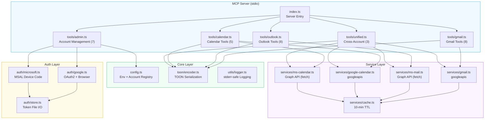
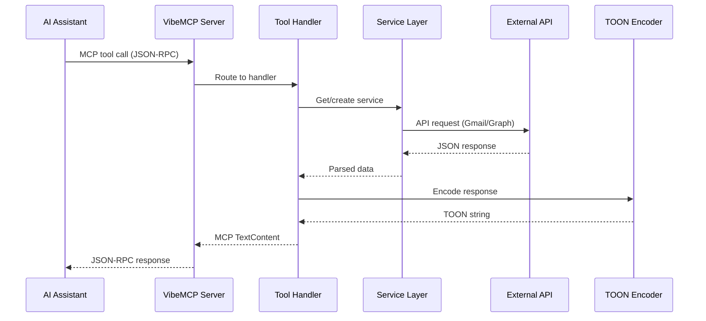

# Ecosystem

VibeMCP is part of a growing ecosystem of token-optimized MCP tools built by [VibeTensor](https://vibetensor.com).

## Architecture



## Source Structure

```
src/
├── index.ts                # MCP server entry + tool registration
├── cli.ts                  # CLI entry point (auth, accounts, serve)
├── config.ts               # Environment loading, account registry
├── auth/
│   ├── google.ts           # Google OAuth2 with local callback server
│   ├── microsoft.ts        # Microsoft MSAL Device Code Flow
│   └── store.ts            # Token file I/O helpers
├── services/
│   ├── gmail.ts            # Gmail API service (googleapis)
│   ├── ms-mail.ts          # Microsoft Graph Mail (native fetch)
│   ├── google-calendar.ts  # Google Calendar API service
│   ├── ms-calendar.ts      # Microsoft Graph Calendar (native fetch)
│   └── cache.ts            # Service instance cache (10-min TTL)
├── tools/
│   ├── admin.ts            # Account management tools (7)
│   ├── gmail.ts            # Gmail tool handlers (8)
│   ├── outlook.ts          # Outlook tool handlers (8)
│   ├── calendar.ts         # Unified calendar tools (5)
│   └── unified.ts          # Cross-account aggregation (3)
├── toon/
│   ├── encoder.ts          # TOON serialization
│   └── types.ts            # ToonOptions interface
└── utils/
    ├── logger.ts           # stderr-safe logging
    └── errors.ts           # Error formatting
```

## Design Decisions

### stderr-safe Logging

`console.log` is redirected to `console.error` at import time. MCP uses stdout for JSON-RPC communication — any stray `console.log` would corrupt the protocol stream.

### Static Factory Pattern

Services use `ServiceClass.create(email)` because auth initialization is async. The factory creates the service, acquires tokens, and returns a ready-to-use instance.

### Provider Auto-Detection

Calendar tools check the account registry to route requests to the correct service (Google Calendar vs Outlook Calendar) based on the email address.

### Service Cache

Authenticated service instances are cached with a 10-minute TTL. This avoids repeated token acquisition for consecutive tool calls.

### Config Directory

All persistent data (`~/.vibemcp/`) is stored in the user's home directory, not in the working directory or npm cache. This ensures tokens survive across `npx` invocations.

## Request Flow



## Roadmap

### v0.1.x — Current (Stable)

- 31 MCP tools (admin, gmail, outlook, calendar, unified)
- TOON output with 51% average token savings
- Multi-account Google + Microsoft
- Cross-account unified search, inbox, calendar
- CLI for authentication and account management
- Test suite, ESLint, Prettier, Docker support

### v0.2 — Polish

- Attachment handling (upload / download)
- Google Calendar event update
- Gmail label management
- Expanded test coverage

### v0.3 — Expand

- Slack integration
- Todoist integration
- Semantic caching layer
- Rate limiting

### v1.0 — Production

- Hosted OAuth (no user GCP / Azure setup needed)
- Teams chat integration
- Google Drive / OneDrive
- Enterprise SSO

## Contributing

We welcome contributions! See [CONTRIBUTING.md](https://github.com/VibeTensor/vibemcp/blob/main/CONTRIBUTING.md) for guidelines.

**High-priority areas:**
- Unit and integration tests
- New service modules (Slack, Todoist, Discord)
- TOON encoder improvements
- Documentation and examples

## License

[PolyForm Noncommercial 1.0.0](https://polyformproject.org/licenses/noncommercial/1.0.0/) — [VibeTensor Private Limited](https://vibetensor.com)

Free for personal use, research, education, hobby projects, and noncommercial organizations. Commercial use requires a separate license from VibeTensor.
