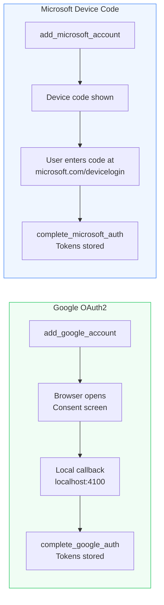
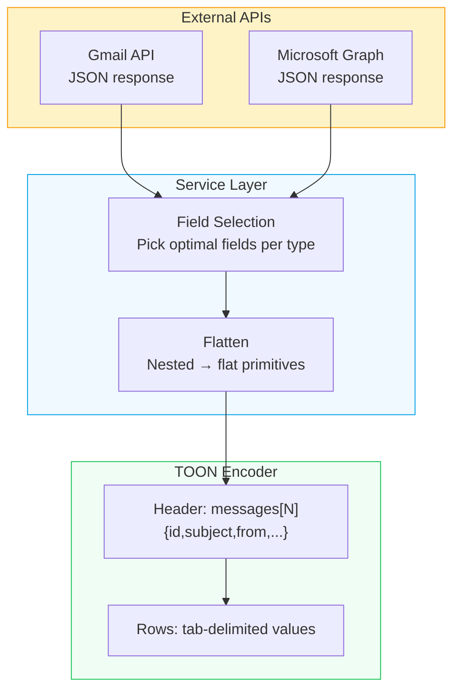

# Integrations

VibeMCP connects to two email/calendar ecosystems through their official APIs.

## Authentication Flows



## Gmail

**API:** [Gmail API](https://developers.google.com/gmail/api) via `googleapis` npm package

**Auth:** OAuth 2.0 with browser-based consent flow. Local callback server on `http://localhost:4100/code`.

**Tools:**

| Tool | API Endpoint |
|:-----|:-------------|
| `gmail_list_messages` | `GET /gmail/v1/users/{userId}/messages` |
| `gmail_get_message` | `GET /gmail/v1/users/{userId}/messages/{id}` |
| `gmail_send_message` | `POST /gmail/v1/users/{userId}/messages/send` |
| `gmail_reply_to_message` | `POST /gmail/v1/users/{userId}/messages/send` (with threading) |
| `gmail_create_draft` | `POST /gmail/v1/users/{userId}/drafts` |
| `gmail_list_labels` | `GET /gmail/v1/users/{userId}/labels` |
| `gmail_list_threads` | `GET /gmail/v1/users/{userId}/threads` |
| `gmail_get_thread` | `GET /gmail/v1/users/{userId}/threads/{id}` |

**TOON field mapping:**

```
messages[N]{id,subject,from,date,snippet}
```

Fields are extracted from Gmail message headers (`Subject`, `From`, `Date`) and metadata (`id`, `snippet`).

## Outlook Mail

**API:** [Microsoft Graph](https://learn.microsoft.com/en-us/graph/api/resources/mail-api-overview) via native `fetch`

**Auth:** Device Code Flow via `@azure/msal-node`. No browser redirect needed — ideal for CLI environments.

**Tools:**

| Tool | API Endpoint |
|:-----|:-------------|
| `outlook_list_messages` | `GET /me/mailFolders/{id}/messages` |
| `outlook_get_message` | `GET /me/messages/{id}` |
| `outlook_send_message` | `POST /me/sendMail` |
| `outlook_reply_to_message` | `POST /me/messages/{id}/reply` |
| `outlook_forward_message` | `POST /me/messages/{id}/forward` |
| `outlook_list_folders` | `GET /me/mailFolders` |
| `outlook_move_message` | `POST /me/messages/{id}/move` |
| `outlook_search` | `GET /me/messages?$search=` |

**TOON field mapping:**

```
messages[N]{id,subject,from,receivedDateTime,isRead,preview}
```

The `from` field is flattened from `from.emailAddress.address`.

## Google Calendar

**API:** [Google Calendar API](https://developers.google.com/calendar/api) via `googleapis` npm package

**Auth:** Same OAuth 2.0 flow as Gmail (shared credentials).

**TOON field mapping:**

```
events[N]{id,summary,start,end,location,organizer}
```

Deep flattening: `start.dateTime` -> `start`, `organizer.email` -> `organizer`. This produces the highest token savings (70%).

## Outlook Calendar

**API:** [Microsoft Graph Calendar](https://learn.microsoft.com/en-us/graph/api/resources/calendar) via native `fetch`

**Auth:** Same Device Code flow as Outlook Mail (shared tokens).

**TOON field mapping:**

```
events[N]{id,subject,start,end,location,organizer}
```

Partial flattening: `organizer.emailAddress.address` -> `organizer`, but `start`/`end` retain `{ dateTime, timeZone }` structure.

## Data Flow



## Privacy

VibeMCP is a passthrough — it fetches from APIs on demand and stores nothing beyond OAuth tokens. Token files are local JSON in `~/.vibemcp/`. No telemetry, no hosted services, no data retention.

See [Privacy Policy](https://github.com/VibeTensor/vibemcp/blob/main/PRIVACY.md) and [Security Policy](https://github.com/VibeTensor/vibemcp/blob/main/SECURITY.md).
