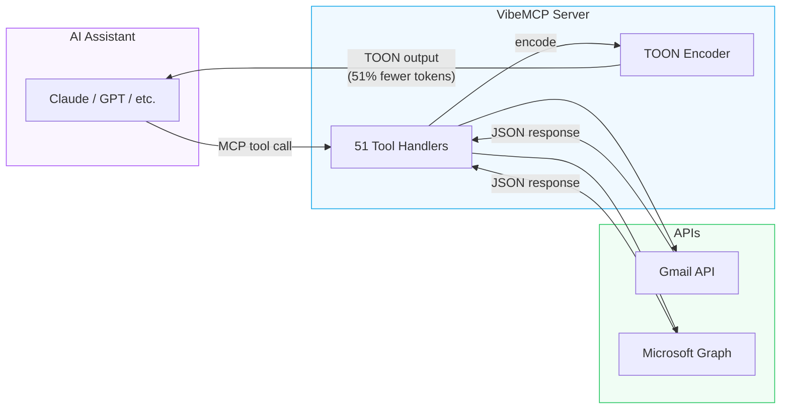

# What is VibeMCP?

VibeMCP is a **Token-Optimized Unified MCP Server** for Gmail and Microsoft 365. It connects your AI assistant to your email and calendar accounts while using up to **51% fewer tokens** than traditional JSON-based MCP servers.

## The Problem

Most email and calendar MCP servers return verbose JSON:

```json
[
  {"id": "abc123", "subject": "Meeting Tomorrow", "from": "john@example.com", "date": "2025-12-18", "snippet": "Let's meet at 3pm..."},
  {"id": "def456", "subject": "Q4 Report", "from": "jane@example.com", "date": "2025-12-17", "snippet": "Please review the..."}
]
```

**~85 tokens** for 2 messages. Repeated keys eat tokens on every row.

## The Solution

VibeMCP uses [TOON (Token-Oriented Object Notation)](https://github.com/toon-format/toon), an open format that declares the schema once, then streams data as tab-delimited rows:

```
messages[2]{id,subject,from,date,snippet}
abc123	Meeting Tomorrow	john@example.com	2025-12-18	Let's meet at 3pm...
def456	Q4 Report	jane@example.com	2025-12-17	Please review the...
```

**~38 tokens** for the same data. No repeated keys, no brackets, no quotes.

## How It Fits Together



## Key Features

- **51 tools** across Gmail, Outlook, Google Calendar, Outlook Calendar, and Contacts
- **TOON output** with per-call `format` parameter (switch to JSON anytime)
- **Multi-account** - connect multiple Google and Microsoft accounts
- **Cross-account** search, unified inbox, and merged calendar
- **Self-hosted** - no telemetry, no data retention, fully local

## Comparison

| Feature | VibeMCP | gmail-mcp | ms-365-mcp-server |
|:--------|:-------:|:---------:|:-----------------:|
| Gmail | 16 tools | 60+ tools | - |
| Outlook Mail | 16 tools | - | 90+ tools |
| **Unified (both)** | **Yes** | No | No |
| **TOON output** | **Yes** | No | No |
| **Multi-account** | **Native** | No | No |
| Token savings | **51%** | None | None |

Existing TOON MCP servers (like `toon-mcp`) are generic JSON-to-TOON converters. VibeMCP encodes at the **source level**, selecting optimal fields per data type for maximum savings.

## Next Steps

- [Getting Started](/guide/getting-started) - install and authenticate in under 5 minutes
- [TOON Format](/guide/toon-format) - how the token optimization works
- [Tools Reference](/reference/tools) - all 51 tools documented
