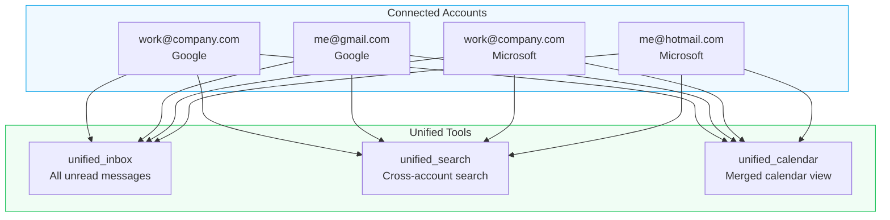
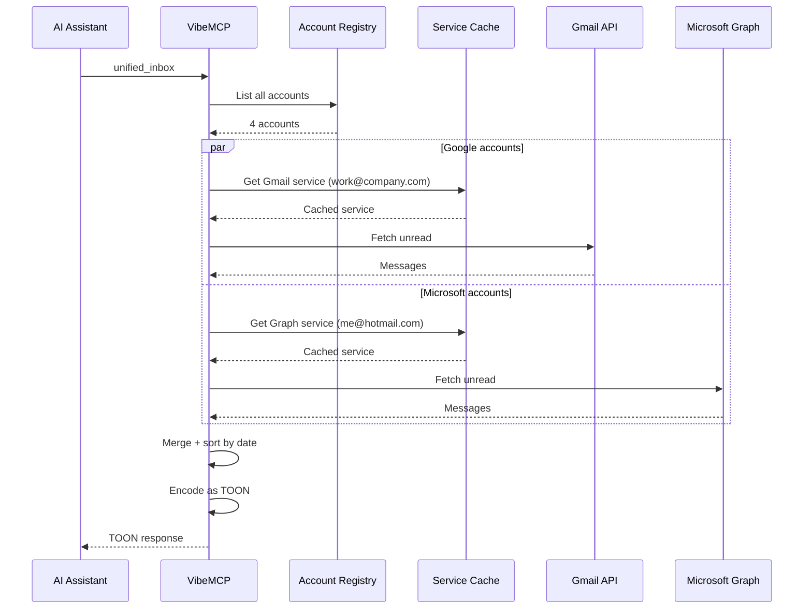

# Multi-Account Authentication

VibeMCP supports connecting multiple Google and Microsoft accounts simultaneously. This enables cross-account operations like unified inbox and merged calendar views.

## How Multi-Account Works



## Adding Accounts

### Multiple Google Accounts

```
> Add my work Google account (work@company.com)
  → add_google_account
  → complete_google_auth

> Add my personal Google account (me@gmail.com)
  → add_google_account
  → complete_google_auth
```

### Multiple Microsoft Accounts

```
> Add my work Microsoft account (work@company.com)
  → add_microsoft_account
  → complete_microsoft_auth

> Add my personal Outlook account (me@hotmail.com)
  → add_microsoft_account
  → complete_microsoft_auth
```

### Mixed Providers

You can connect both Google and Microsoft accounts. VibeMCP auto-detects the provider when routing tool calls.

## Cross-Account Tools

### Unified Inbox

Aggregates unread messages from all connected accounts:

```
> Show my unified inbox
```

Returns messages from all accounts, sorted by date.

### Unified Search

Search across all email accounts simultaneously:

```
> Search all accounts for "quarterly report"
```

### Unified Calendar

Merged calendar view across all providers:

```
> Show my calendar for this week
```

## Account Management

### List Connected Accounts

```
> list_accounts
```

Shows all accounts with their provider type and auth status.

### Remove an Account

```
> remove_account email="work@company.com"
```

### Check Status

```
> accounts_status
```

Shows detailed auth status and server configuration.

## How It Works Internally



- Each account's OAuth tokens are stored separately in `~/.vibemcp/`
- VibeMCP maintains a service cache with 10-minute TTL per account
- Calendar tools auto-detect the provider (Google vs Microsoft) based on the account registry
- Unified tools fan out queries to all connected accounts and merge results
