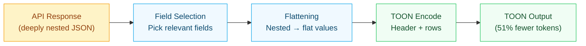

# TOON Format

[TOON (Token-Oriented Object Notation)](https://github.com/toon-format/toon) is an open data format (v3.0, MIT licensed) designed to encode structured data with fewer tokens than JSON. VibeMCP is the first email and calendar MCP server with native TOON output.

## Format Overview

### Tabular Arrays

Most MCP tool outputs are lists of similar objects. TOON encodes these as a header + rows:

```
messages[3]{id,subject,from,date,snippet}
msg001	Meeting Tomorrow	john@example.com	2025-12-18	Let's meet at 3pm
msg002	Q4 Report	jane@example.com	2025-12-17	Please review the attached
msg003	Lunch?	bob@example.com	2025-12-16	Are you free Thursday
```

**Header:** `typeName[count]{field1,field2,...}` declares the schema once.
- `messages` - type label
- `[3]` - row count (enables LLM to verify completeness)
- `{id,subject,from,date,snippet}` - column names in order

**Rows:** Tab-delimited values. One row per object. No repeated keys, no brackets, no quotes.

The equivalent JSON repeats `"id"`, `"subject"`, `"from"`, `"date"`, `"snippet"` for every row. For a 10-message response, TOON eliminates 45 repeated key strings.

### Single Objects

For individual records (e.g., full email detail), TOON uses key-value format:

```
message:
  id: msg001
  subject: Meeting Tomorrow
  from: john@example.com
  to: alice@company.com
  date: 2025-12-18T10:30:00Z
  body: Let's meet at 3pm in the conference room.
```

## Why TOON Beats JSON for LLMs

1. **No repeated keys** - JSON repeats field names for every item. TOON declares fields once.
2. **No syntax noise** - No `{`, `}`, `[`, `]`, `"`, `,` characters consuming tokens.
3. **Self-describing schema** - The `[count]{fields}` header tells the LLM what to expect.
4. **JSON fallback** - Every tool accepts `format: "json"` for debugging.

## Source-Level Encoding

Unlike generic JSON-to-TOON converters, VibeMCP encodes at the **source level**:



1. **Field selection** - Each data type uses a curated set of fields, not the full API response
2. **Flattening** - Nested API objects are transformed to flat primitives before encoding
3. **Type-aware** - Calendar events, emails, and folders each get optimal field layouts

### Field Selection Per Data Type

| Data Type | TOON Fields | Excluded |
|-----------|-------------|----------|
| Gmail messages (list) | `id, subject, from, date, snippet` | `to, cc, labelIds, body, threadId` |
| Outlook messages (list) | `id, subject, from, receivedDateTime, isRead, preview` | `body, toRecipients, hasAttachments` |
| Google Calendar events | `id, summary, start, end, location, organizer` | `attendees, recurrence, conferenceData` |
| Outlook Calendar events | `id, subject, start, end, location, organizer` | `attendees, body, isOnlineMeeting` |
| Gmail labels | `id, name, type` | `messagesTotal, messagesUnread, color` |
| Outlook folders | `id, displayName, totalItemCount, unreadItemCount` | `childFolderCount, parentFolderId` |

### Nested Object Handling

API responses from Google and Microsoft contain deeply nested structures. VibeMCP's service layer flattens them:

**Google Calendar** (full flattening):
- `start.dateTime` or `start.date` -> `start` (flat string)
- `organizer.email` -> `organizer` (flat string)
- Result: 70% token savings

**Outlook / Microsoft Graph** (smart flattening):
- `from.emailAddress.address` -> `from` (flat string)
- `start.dateTime` -> `start` (auto-extracts dateTime from `{dateTime, timeZone}` objects)
- Primitive arrays -> pipe-separated (`["INBOX","UNREAD"]` -> `INBOX|UNREAD`)
- Long values -> truncated to 500 chars with `...` suffix
- Result: 41% token savings

## Why Savings Vary

- **Flat data** (labels, folders): ~25-35% savings
- **Moderate nesting** (emails): ~38-41% savings
- **Deep nesting** (calendar events): ~60-70% savings

## Schema Evolution

TOON headers are self-describing. Each response declares its own schema. If a new field is added, the header simply includes it. The LLM reads the header and knows what columns to expect, so no version negotiation is needed.

## TOON v3.0 Spec Compatibility

| TOON Feature | VibeMCP Support | Notes |
|-------------|:---------------:|-------|
| Tabular arrays `[N]{fields}` | Yes | Primary format for list tools |
| Key-value objects | Yes | Detail views |
| Tab delimiter | Yes (default) | Safe for natural language |
| Comma/pipe delimiter | Configurable | Via `ToonOptions` |
| Nested objects (indentation) | No | Service layer flattens instead |
| Calendar object flattening | Yes | `{dateTime, timeZone}` auto-extracted |
| Primitive array flattening | Yes | `["a","b"]` -> `a\|b` |
| Value truncation | Yes | Default 500 chars, configurable |
| Quoted strings | Yes | Auto-applied when needed |
| Escape sequences | Yes | Per TOON v3.0 spec |
| Count validation `[N]` | Yes | Always included |
| HTML stripping | Yes | `stripHtml()` utility for email bodies |

## VibeMCP's Approach vs Generic TOON Converters

Existing TOON MCP servers (like `toon-context-mcp`) convert JSON to TOON after the fact. VibeMCP is different:

| Approach | Generic Converter | VibeMCP |
|:---------|:-----------------:|:-------:|
| When encoding happens | Post-hoc (JSON -> TOON) | At source (API -> TOON) |
| Field selection | All fields | Curated per data type |
| Nested data | Pass through or indent | Flatten in service layer |
| Token savings | ~30% | ~51% |

The key insight: most token waste comes from **repeated keys** and **unnecessary fields**, not just JSON syntax. By selecting fields and flattening at the service layer, VibeMCP achieves higher savings than a generic converter ever could.

## Future Directions

Based on analysis of the TOON v3.0 spec, ecosystem, and competing approaches (TRON, Cloudflare Code Mode, Speakeasy Dynamic Toolsets):

- **Key folding**: Adopt spec v3.0 dotted path notation for single-key wrappers (e.g., `start.dateTime`)
- **Dynamic field selection**: Expose a `fields` parameter on list tools so LLMs request only needed columns
- **Streaming TOON**: Progressive row-by-row delivery for large datasets using `encodeLines()` pattern
- **Tool presets**: Load only email or calendar tool schemas to reduce input token overhead
- **Native MCP support**: Contribute to MCP spec for `encoding: toon` capability negotiation

## Further Reading

- [TOON Specification v3.0](https://github.com/toon-format/spec)
- [TOON Format Repository](https://github.com/toon-format/toon)
- [VibeMCP Encoder Source](https://github.com/VibeTensor/vibemcp/blob/main/src/toon/encoder.ts)
