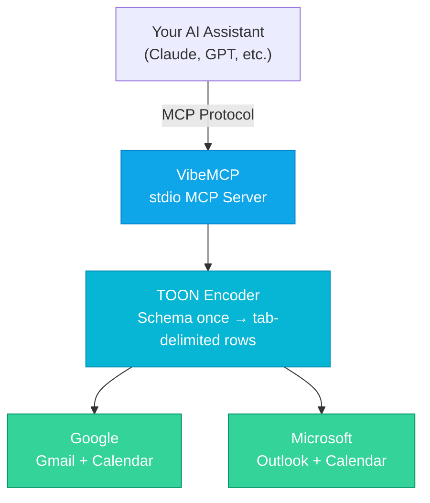

<div class="vp-doc" style="max-width: 688px; margin: 0 auto; padding: 0 24px;">

## Token Savings (Real Benchmarks)

Measured on live accounts with real data, February 2026:

| Dataset | JSON Tokens | TOON Tokens | Savings |
|:--------|:-----------:|:-----------:|:-------:|
| Gmail (10 messages) | 961 | 591 | **38%** |
| Outlook (10 messages) | 1,480 | 872 | **41%** |
| Google Calendar (11 events) | 1,462 | 441 | **70%** |
| **Combined** | **3,903** | **1,904** | **51%** |

Every tool call that returns data costs fewer tokens. Over a conversation with dozens of tool calls, the savings compound.

## How It Works



## Quick Start

### 1. Add to Claude Desktop / Claude Code

```json
{
  "mcpServers": {
    "vibemcp": {
      "command": "npx",
      "args": ["-y", "@vibetensor/vibemcp"],
      "env": {
        "GOOGLE_CLIENT_ID": "your-google-client-id",
        "GOOGLE_CLIENT_SECRET": "your-google-client-secret",
        "MICROSOFT_CLIENT_ID": "your-azure-client-id",
        "MICROSOFT_TENANT_ID": "common"
      }
    }
  }
}
```

### 2. Authenticate Through Your AI

```
You: "Add my Google account user@gmail.com"
AI:  Opens browser → you sign in → done

You: "Add my Microsoft account user@outlook.com"
AI:  Shows a device code → you enter it at microsoft.com/devicelogin → done
```

### 3. Start Using It

```
You: "Show my latest emails"
You: "Search for emails from john@example.com"
You: "Send an email to jane@company.com about the meeting"
You: "What's on my calendar this week?"
You: "Create a meeting with the team on Friday at 2pm"
```

[Full setup guide →](/guide/getting-started)

## Why Not Just Use Separate MCP Servers?

| | VibeMCP | gmail-mcp + ms-365-mcp |
|:--|:------:|:----------------------:|
| Servers to install | **1** | 2 |
| Token format | **TOON (51% savings)** | JSON |
| Multi-account | **Built-in** | Not supported |
| Unified inbox / calendar | **Yes** | No |
| Cross-account search | **Yes** | No |

## Built By

[VibeTensor Private Limited](https://vibetensor.com) - Building token-efficient AI infrastructure.

[PolyForm Noncommercial License](https://polyformproject.org/licenses/noncommercial/1.0.0/) - Free for personal use, research, education, and hobby projects.

</div>
